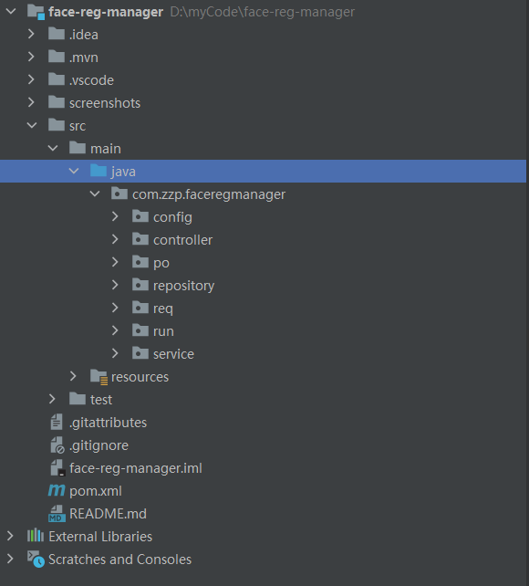
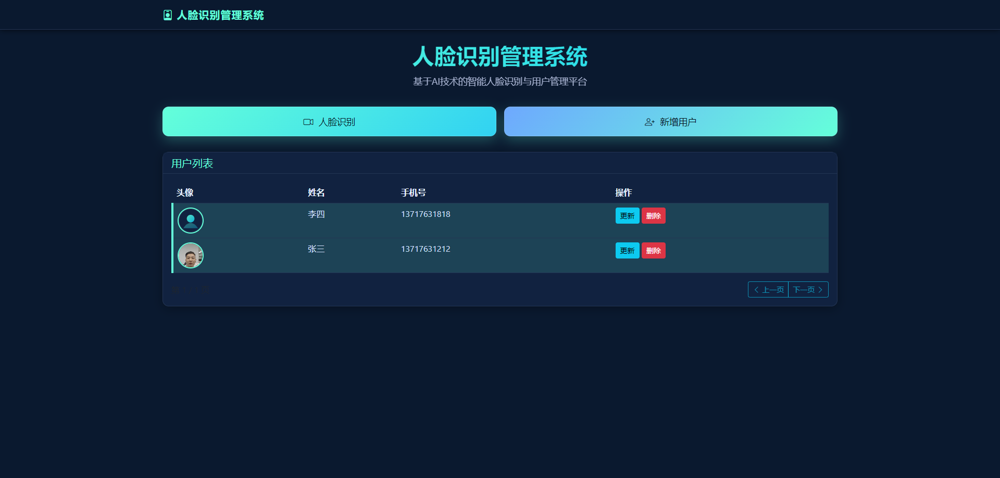
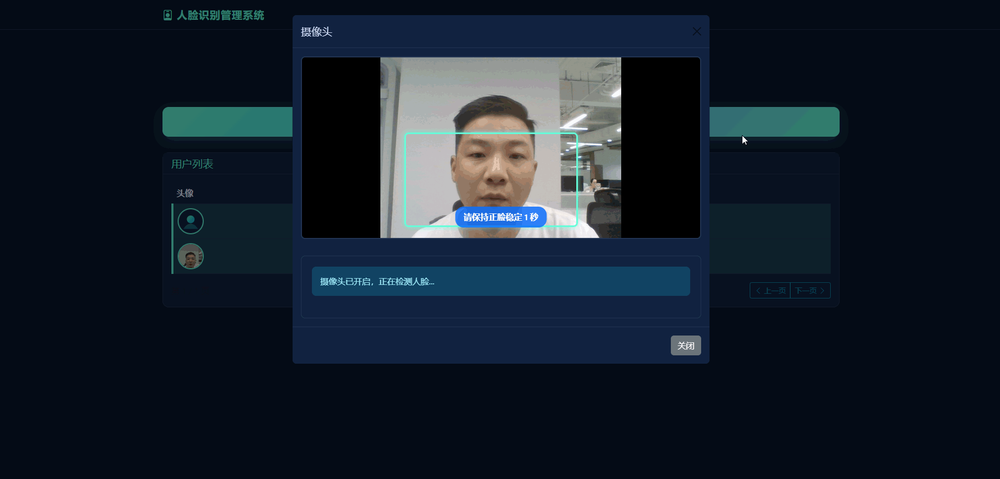

# 人脸识别管理系统

基于识度AI的人脸识别管理系统，实现人脸注册、识别、用户管理等功能。

## 项目介绍

这是一个基于Spring Boot开发的人脸识别管理系统，集成了识度AI的人脸识别服务。系统提供了完整的用户管理功能，包括人脸注册、人脸识别、用户信息维护等。前端采用现代化的Bootstrap 5框架，实现了友好的用户界面和流畅的交互体验。

### 核心功能

- **人脸注册**: 通过摄像头采集用户人脸信息并注册到识度AI平台
- **人脸识别**: 实时识别人脸并匹配数据库中的用户信息
- **用户管理**: 完整的用户信息增删改查功能
- **响应式界面**: 支持PC端和移动端访问

## 技术栈

- 后端：Spring Boot 2.7.0
- 数据库：MySQL 8.0+/H2(测试)
- 前端：Bootstrap 5, face-api.js
- AI服务：识度AI人脸识别API
- 构建工具：Maven

## 快速开始

### 环境要求

- JDK 1.8+
- Maven 3.6+
- MySQL 8.0+ (或使用H2内存数据库进行测试)

### 安装步骤

1. 克隆项目到本地：
   ```bash
   git clone https://github.com/uncle-Parker/face-reg-manager.git
   cd face-reg-manager
   ```

2. 配置数据库：
   - 修改 [src/main/resources/application.properties](file:///d%3A/myCode/face-reg-manager/src/main/resources/application.properties) 中的数据库连接信息
   - 确保MySQL服务已启动并创建了对应的数据库

3. 配置识度AI API：
   - 注册[识度AI平台](https://facedegree.cn/)账号
   - 获取API Key和Secret
   - 修改 [src/main/resources/application.properties](file:///d%3A/myCode/face-reg-manager/src/main/resources/application.properties) 中的API配置

4. 编译和运行：
   ```bash
   mvn clean install
   mvn spring-boot:run
   ```

5. 访问应用：
   - 浏览器打开 http://localhost:8080

### API接口文档

#### 人脸相关接口

- `POST /api/faces/register` - 人脸注册
- `POST /api/faces/recognize` - 人脸识别

#### 用户相关接口

- `GET /api/users` - 获取用户列表
- `PUT /api/users/{id}` - 更新用户信息
- `DELETE /api/users/{id}` - 删除用户

## 项目截图
*项目工程*



*用户管理*


*人脸识别功能*




## 相关链接

- [识度AI平台](https://facedegree.cn/)
- [人脸检测js](https://github.com/justadudewhohacks/face-api.js/)
- [Spring Boot](https://spring.io/projects/spring-boot)
- [Bootstrap](https://getbootstrap.com/)

## 打赏码

如果您觉得这个项目对您有帮助，欢迎扫码打赏支持开发者：


*微信打赏*


## 许可证

本项目采用 MIT 许可证，详情请见 [LICENSE](LICENSE) 文件。